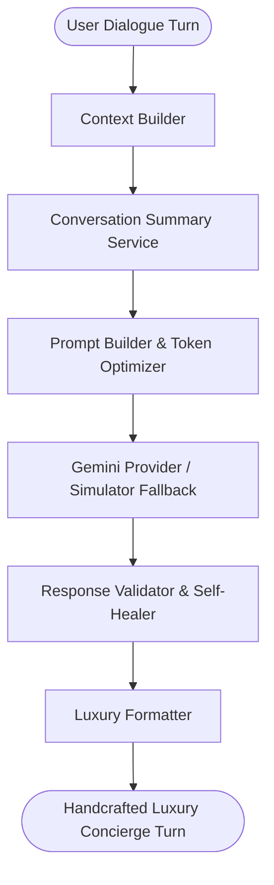

# CHARIS — Luxury AI Architecture & Orchestration

This document details the multi-stage AI orchestration pipeline and observability metrics of the CHARIS Luxury AI Gift Concierge.

---

## 1. Upgraded AI Pipeline & Curation Loop

---

## 2. Stage Breakdown & Responsibilities

### I. Context Builder (`context_builder.py`)
Compiles structured parameters from the database:
- User Preferences (Theme, Language, Currency).
- Recipient Profile (Hobbies, Colors, Luxury preferences).
- Past Gifts history (to prevent duplicates and establish continuity).

### II. Conversation Summary Service (`conversation_summary.py`)
Generates structured state summary of the dialogue history (e.g. current occasion, budget, emotional intent) to optimize context sizes and minimize token cost.

### III. Prompt Builder (`prompt_builder.py`)
Combines system prompts, context summaries, and user inputs. Deduplicates and optimizes payload token bounds.

### IV. Response Validator (`response_validator.py`)
Applies safety checks. If validation fails, it triggers self-healing retries before sending output.

### V. Luxury Formatter (`luxury_formatter.py`)
Translates validated output into premium layouts (e.g. visual separators, paragraph margins, gold-italicized blockquotes).

---

## 3. Observability & Performance Metrics
Every dialogue transaction prints trace data to the system logger:
- **Latencies**: Context compile time, summarization time, prompt compose time, API roundtrip, validator checks, and formatter layout times.
- **Payload metrics**: Prompt characters, completion characters, and estimated token totals.
- **Trace tags**: Session ID, fallback indicators, and transaction outcomes.
