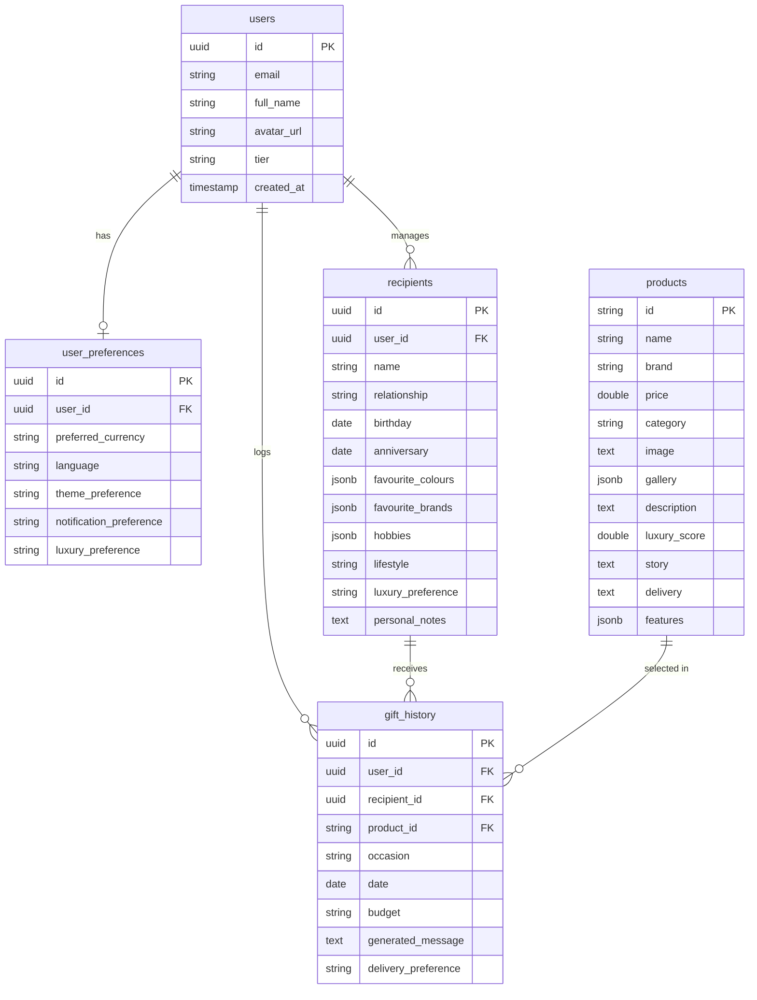

# CHARIS Database Schema & Postgres Curation

## PostgreSQL Normalized Relational Model



## Row Level Security (RLS) Configuration

Supabase Row Level Security guarantees that patrons only query their own dossiers.

```sql
-- 1. Enable RLS on recipients table
ALTER TABLE recipients ENABLE ROW LEVEL SECURITY;

-- 2. Create Security Policy
CREATE POLICY "Patrons can only read own recipients"
ON recipients FOR SELECT
TO authenticated
USING (user_id = auth.uid());

CREATE POLICY "Patrons can write own recipients"
ON recipients FOR INSERT
TO authenticated
WITH CHECK (user_id = auth.uid());
```

## Product Catalog Seeding (50 Items)
Product prices are seeded in **Indian Rupees (₹)**:
- Vacheron Constantin Celestial Watch: ₹58,50,000
- Sabyasachi Polki Emerald Necklace: ₹1,25,00,000
- Taj Lake Palace Udaipur Retreat: ₹18,50,000
- Apple Watch Hermès Titanium: ₹1,75,000
